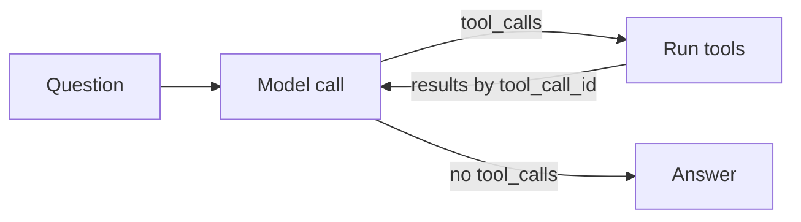

# Architecture

Mekiki is a command line agent that recommends npm packages. You ask a question, it looks up real registry data through tools, and it answers with one pick and up to two alternatives.

## Files

| File              | Purpose                                                                  |
| ----------------- | ------------------------------------------------------------------------ |
| `agent.ts`        | The whole agent: tool schemas, tool functions, and the loop              |
| `README.md`       | What Mekiki is, setup, and things to try                                 |
| `.env`            | `OPENAI_API_KEY`, `OPENAI_MODEL` and `NEATLOGS_API_KEY`, never committed |
| `architecture.md` | How the agent works                                                      |
| `decisions.md`    | Why it works that way, and what we rejected                              |
| `evals.md`        | Test questions, their answer keys, and scored results                    |

## The loop

`runAgent` keeps a `messages` array and calls the model with it and the tool list. If the reply asks for tools, the loop runs them in parallel with `Promise.all`, appends each result tagged with its `tool_call_id`, and calls the model again. If the reply has no tool calls, that text is the answer. `MAX_STEPS` caps the number of model turns, not tool calls, since one turn can request several tools in parallel.



## Tools

Each tool has two halves. The schema in `tools` is what the model reads. The function is plain TypeScript that the loop runs on the model's behalf.

| Tool                     | Source                                                  | Returns                                                                                                                            |
| ------------------------ | ------------------------------------------------------- | ---------------------------------------------------------------------------------------------------------------------------------- |
| `search_packages(query)` | npm search API, 25 results                              | Top 8 by weekly downloads: name, description, downloads                                                                            |
| `get_package_info(name)` | `/<name>/latest` plus an exact-name search, in parallel | Description, version, last publish date, months since that publish, license, repository, downloads, deprecation, or `found: false` |

Tool results go back as JSON strings and stay in the context for every later turn, so each tool returns only the fields the model needs.

## How it picks

The system prompt is a numbered process. The model first names the packages it knows developers choose for the job, then checks them with `get_package_info` while `search_packages` looks for anything it missed. Its knowledge says what people choose. The tools say whether those packages exist, are maintained, and how widely they're installed. Packages that share a `repository` count as one project.

## Tracing

Neatlogs records every run as one trace:

```
WORKFLOW advise
└─ AGENT npm_advisor
   ├─ LLM (one per model turn, from wrapOpenAI)
   ├─ TOOL search_packages
   └─ TOOL get_package_info
```

`init()` runs once at startup. `openai` is the only OpenAI client, wrapped with `wrapOpenAI`, so no model call escapes the trace. Tool functions are wrapped with `span({ kind: 'TOOL' })`, which records their inputs and outputs. `shutdown()` runs in a `finally` block so spans get sent even when the run crashes.

## Known gaps

- If npm returns an error status, the tool throws and the whole run crashes. The model never gets a chance to recover.
- Deprecated packages often drop out of npm search, so their publish date and downloads come back `null`.
- `get_package_info` confirms a package exists and is maintained, not that it fits the job. If the model names the wrong package from memory, nothing catches it.
- Search results depend heavily on wording. The tool description asks the model to try several phrasings.
